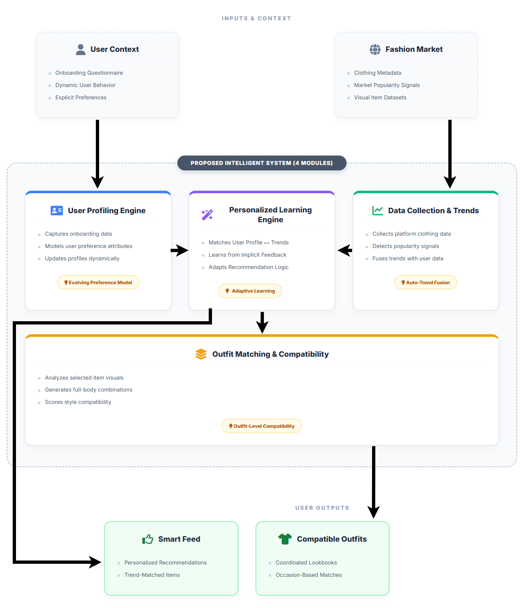

# Smart Fashion Assistant
### An Intelligent Personalized and Trend-Aware Fashion Recommendation System


> **Research Project** | Faculty of Computing, SLIIT  
> **Specialization:** Information Technology  
> **Domain:** Fashion E-Commerce & Artificial Intelligence

---

## 📖 Executive Summary

**Smart Fashion Assistant** is a web-based intelligent system designed to solve decision paralysis in online fashion shopping. Unlike traditional platforms that rely on static filters or generic popularity metrics, this system integrates **four interconnected machine learning engines** to provide a holistic shopping assistant.

[cite_start]The system addresses the gap between **user personalization**, **real-time market trends**, and **outfit-level compatibility**, offering a solution that not only recommends individual items but also continuously learns from user behavior and suggests coordinated looks[cite: 65, 67].

---

## 🏗️ Conceptual Architecture


*(Please place your generated diagram screenshot in an 'assets' folder and name it 'architecture_diagram.png')*

[cite_start]The system operates on a modular architecture where four distinct ML components interact to process user data and market signals[cite: 70, 72].

---

## 🔬 Research Components & Novelty

The project is divided into four specialized research modules, each addressing a specific limitation in current e-commerce systems.

### 👤 Module 01: User Profiling & Preference Modeling
**Developer:** Ramanayake A.R.M.C.N.K (IT22247636)

> **Novelty:** Introduces a **Dynamic Preference Model** that evolves beyond static onboarding data. [cite_start]It continuously updates user feature vectors based on real-time interaction behavior, ensuring the profile remains accurate over time[cite: 109].

* **Key Tasks:**
    * Design of onboarding logic to capture style, climate, and body-type context.
    * Dynamic encoding of user attributes into preference vectors.
    * Real-time profile updating based on implicit user actions.

### 🧠 Module 02: Personalized Recommendation & Learning Engine (Core)
**Developer:** Gunathilake T.M.P.G.K.N (IT22189608)

> **Novelty:** Implements a **Real-Time Adaptive Learning** mechanism. [cite_start]Unlike offline models that update periodically, this engine adapts its ranking logic instantly using implicit feedback signals (clicks, dwell time, favorites)[cite: 109].

* **Key Tasks:**
    * Hybrid matching of User Profiles $\leftrightarrow$ Clothing Items.
    * Implementation of content-based filtering and ranking algorithms.
    * Integration of implicit feedback loops for continuous weight adjustment.

### 📈 Module 03: Data Collection & Trend Analysis
**Developer:** G.D. Elladeniya (IT22202840)

> **Novelty:** Features **Automated Trend–Preference Fusion**. [cite_start]Instead of treating trends as manual inputs, this module automatically scrapes and analyzes market data to detect rising styles, fusing these "trend signals" into the personalized feed[cite: 109].

* **Key Tasks:**
    * Automated extraction of clothing metadata from external fashion platforms.
    * Time-series analysis to detect rising popularity trends.
    * Generation of trend scores to influence recommendation ranking.

### 🧥 Module 04: Outfit Matching & Style Compatibility
**Developer:** Rajapaksha P.D.S.S (IT22218476)

> **Novelty:** Focuses on **Outfit-Level Compatibility**. [cite_start]Moving beyond single-item suggestions, this component analyzes visual and textual attributes to recommend complementary garments (e.g., matching a selected top with compatible bottoms)[cite: 109].

* **Key Tasks:**
    * Visual attribute extraction for compatibility scoring.
    * Generation of valid Top-Bottom and Top-Outerwear combinations.
    * Context-aware outfit scoring based on occasion and style rules.

---

## 👥 The Research Team

| Registration ID | Name | Role / Component |
| :--- | :--- | :--- |
| **IT22189608** | Gunathilake T.M.P.G.K.N | **Group Leader** / Personalized Learning Engine |
| **IT22247636** | Ramanayake A.R.M.C.N.K | User Profiling Engine |
| **IT22202840** | G.D. Elladeniya | Data Collection & Trend Analysis |
| **IT22218476** | Rajapaksha P.D.S.S | Outfit Matching |

**Supervision:**
* **Supervisor:** Ms. Dushanthi Kuruppu
* **Co-Supervisor:** Mr. Kavinga Yapa Abeywardena
* [cite_start]**External Supervisor:** Mr. Naleen Karunarathne (Technical Manager, Kelly Felder) [cite: 120]

---

## 🚀 Getting Started (Development)

This repository is organized as a monorepo containing the 4 core research modules.

### Prerequisites
* Python 3.9+
* Node.js (for Web Interface)
* Virtual Environment tool (venv/conda)

### Installation
1.  **Clone the repository**
    ```bash
    git clone [https://github.com/your-org/smart-fashion-assistant.git](https://github.com/your-org/smart-fashion-assistant.git)
    cd smart-fashion-assistant
    ```

2.  **Set up the Python Environment**
    ```bash
    python -m venv venv
    source venv/bin/activate  # On Windows: venv\Scripts\activate
    pip install -r requirements.txt
    ```

3.  **Branching Workflow**
    * **Do not push to `main` or `develop`.**
    * Create a feature branch for your module:
        ```bash
        git checkout -b feature/your-module-name
        ```

---

## ⚖️ Ethical & Sustainability Note
[cite_start]This project contributes to **UN SDG 12 (Responsible Consumption)** by reducing decision error and minimizing the return rates associated with poor online clothing purchases[cite: 32, 42].

---
*© 2026 Smart Fashion Assistant Research Group. All Rights Reserved.*