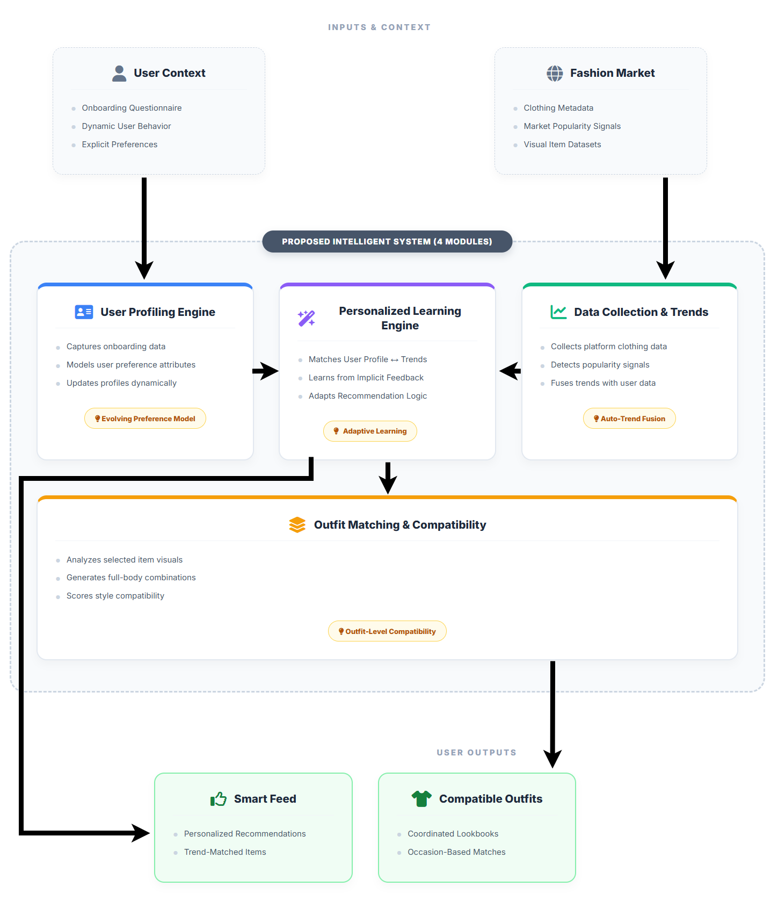

# Smart Fashion Assistant

An intelligent personalized and trend-aware fashion recommendation system for fashion e-commerce research.


> Research Project | Faculty of Computing, SLIIT  
> Specialization: Information Technology  
> Domain: Fashion E-Commerce and Artificial Intelligence

## Executive Summary

Smart Fashion Assistant is a web-based intelligent system designed to reduce decision paralysis in online fashion shopping. The system combines personalization, market trend analysis, and outfit-level compatibility so users can discover individual items and coordinated outfit suggestions.

## Conceptual Architecture



The system is organized as a monorepo with separate frontend, backend, documentation, and research notebook areas.

## Research Components

### Module 01: User Profiling and Preference Modeling

Developer: Ramanayake A.R.M.C.N.K (IT22247636)

Introduces a dynamic preference model that updates user preference vectors from onboarding data and real-time interaction behavior.

### Module 02: Personalized Recommendation and Learning Engine

Developer: Gunathilake T.M.P.G.K.N (IT22189608)

Implements real-time adaptive recommendation ranking using implicit feedback signals such as clicks, dwell time, and favorites.

### Module 03: Data Collection and Trend Analysis

Developer: G.D. Elladeniya (IT22202840)

Collects and analyzes market fashion data to detect trend signals and fuse them into the personalized recommendation feed.

### Module 04: Outfit Matching and Style Compatibility

Developer: Rajapaksha P.D.S.S (IT22218476)

Analyzes visual and textual product attributes to generate compatible outfit combinations around a selected clothing item.

## Project Structure

```text
R26-IT-052/
|-- README.md
|-- backend/
|   |-- README.md
|   `-- server/
|       |-- README.md
|       |-- app/              # FastAPI application package
|       |-- ml_models/        # Trained compatibility model artifacts
|       |-- scripts/          # Backend utility scripts
|       |-- tests/            # Backend checks and tests
|       `-- requirements.txt
|-- docs/
|   `-- assets/               # Diagrams and documentation images
|-- frontend/                 # Flutter client application
`-- notebooks/                # Research notebooks
```

## Getting Started

### Backend

```bash
cd backend/server
python -m venv venv
venv\Scripts\activate
pip install -r requirements.txt
uvicorn app.main:app --reload
```

### Frontend

```bash
cd frontend
flutter pub get
flutter run
```

## Research Team

| Registration ID | Name | Role / Component |
| :--- | :--- | :--- |
| IT22189608 | Gunathilake T.M.P.G.K.N | Group Leader / Personalized Learning Engine |
| IT22247636 | Ramanayake A.R.M.C.N.K | User Profiling Engine |
| IT22202840 | G.D. Elladeniya | Data Collection and Trend Analysis |
| IT22218476 | Rajapaksha P.D.S.S | Outfit Matching |

Supervisor: Ms. Dushanthi Kuruppu  
Co-Supervisor: Mr. Kavinga Yapa Abeywardena  
External Supervisor: Mr. Naleen Karunarathne, Technical Manager, Kelly Felder

## Ethics and Sustainability

This project contributes to UN SDG 12, Responsible Consumption, by helping reduce decision error and return rates caused by poor online clothing purchases.
